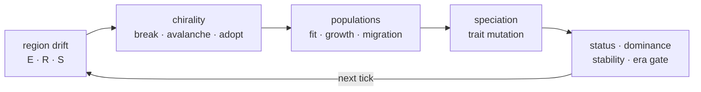

<h1 align="center">Evoverse</h1>

<p align="center">
  <b>A persistent artificial-life observatory.</b><br/>
  A seeded universe where regions, species, populations, and a chronicle of events
  evolve through a deterministic tick engine — and you can travel its history.
</p>

<p align="center">
  <a href="LICENSE"></a>
  
  
  
  
  
  
  
</p>

<p align="center">
  🌐 <a href="https://evoverse.studiobinary.co" target="_blank" rel="noreferrer"><b>Live demo — evoverse.studiobinary.co</b></a> · test environment
</p>

<p align="center">
  <sub>Planned and built 2025–2026 by Bora ERESICI (StudioBinary) ·
  <a href="CHANGELOG.md">Changelog</a> ·
  <a href="docs/DEVELOPMENT.md">Design &amp; approach</a></sub>
</p>

---

## What it is

Alpha is a living, time-travelable observatory rather than a data panel. It runs
continuously, nobody controls it, and its authority over outcomes is absolute — you
**observe**, and at most you nudge.

Two properties are load-bearing and everything else follows from them:

- **Determinism.** `(seed, rules, tick)` always yields the same universe. Every
  random draw is hash-seeded through `stable_rng`; there is no wall clock and no
  global RNG in the step. This is what makes replay, forecast, and honest
  measurement possible at all.
- **Event sourcing.** The chronicle is append-only and every entity carries its
  provenance, so "why did this region collapse?" is a question with an answer you
  can scrub back to.

## The tick pipeline

One tick, in order. Each stage reads what the previous one wrote — the order is part
of the model, not an implementation detail. Full formulas in
[`SIMULATION_FLOW_AND_FORMULAS.md`](docs/SIMULATION_FLOW_AND_FORMULAS.md).



## What's inside

- **Deterministic simulation core** — an aggregate region/species/population model
  with catalyst influence, speciation, and collapse/recovery, benchmarked over
  10,000 ticks.
- **A consumer–resource world** — populations draw their region's resources down,
  which gives Alpha a real carrying capacity and makes two species in one region
  compete for free. Nothing about competition is written as a rule; it falls out of
  the resource.
- **Chirality field & earned eras** — a symmetry-breaking *maturity* subsystem drawn
  from Ozturk & Sasselov's homochirality research. A universe-wide field biases every
  region's pitchfork the same way, so the hand that breaks is contingent but
  **global**; it avalanches, locks, and lineages inherit it one-way with a lethal
  flip mutation. `homochirality_index` — *global* single-handedness, `|mean ee|`, not
  `mean |ee|` — gates a monotonic `Genesis → Expansion → Stabilization → Intelligence`
  progression that must be **earned**. Turn the field off and a universe locks every
  region yet never agrees on a hand, and is correctly denied life.
- **A chronicle that files its own news** — 98% of events are the world's own, not
  scripted beats. Resource shifts and declines are measured against what was last
  reported rather than against the previous tick, which is the only resolution at
  which a slow world has anything to say.
- **Persistence & snapshots** — PostgreSQL-backed append-only event store,
  current-state and tick-level snapshots, Dynamic Report, and realtime chronicle SSE.
- **Authenticated identity behind a BFF** — session/header identity resolver, admin
  role gate, Google OAuth wiring, and same-origin `/api/*` routes so the browser never
  carries local ids or calls the API cross-origin.
- **Editable rules admin** — `/admin/config` draft → validate → apply → rollback with
  risky-change preview, revision/audit history, and hot-reload visibility.
- **Living species surfaces** — Micro Life Field, a time-axis phylogenetic tree, the
  three.js Organism Lens, categorized replay markers, forecast gauges with a
  population fan chart, and a shareable PNG species card.
- **Time navigation** — a persistent universe-map scrubber with Era bands, cinematic
  replay, and Time Zoom that redraws the map from historical snapshots.
- **Spatial universe map** — a hexagon honeycomb laid out from region coordinates,
  with activity waves rippling to neighbours and a global-stability breathing pulse.

## Architecture

| Layer | Stack | Notes |
| --- | --- | --- |
| **Backend** (`backend/`) | FastAPI + a separate simulation worker | Share Alpha through PostgreSQL. The API reads; the worker advances and writes. |
| **Frontend** (`frontend/`) | Next.js App Router | Browser mutations and cross-origin reads are proxied through same-origin `/api/*` BFF routes that attach trusted session headers server-side. |
| **Docs** (`docs/`) | — | API contracts, the operations playbook, and the design essay. See the index below. |

## Quick start

```bash
cp .env.example .env
docker compose up -d postgres
make migrate
make backend     # http://localhost:8000
make frontend    # http://localhost:3000
make worker      # advances Alpha
```

The API and worker are separate processes. With `EVOVERSE_PERSISTENCE=postgres` the
API refreshes Alpha from PostgreSQL on reads while the worker advances it and writes
back.

PostgreSQL is exposed on host port **5433** by default so it does not collide with a
local system PostgreSQL on 5432. If any default port is taken, run each service on a
free port and point the frontend at the backend with `EVOVERSE_API_URL` (server-only,
used by the BFF routes; falls back to `NEXT_PUBLIC_API_URL`). Auth runs in
local-fallback mode by default (`EVOVERSE_AUTH_ALLOW_LOCAL_FALLBACK=true`); see
`.env.example` and [`AUTH_ROLE_GATE_DECISION.md`](docs/AUTH_ROLE_GATE_DECISION.md)
for the Google OAuth and trusted-header contract.

**Migrations** are ordered SQL files in `backend/migrations` plus a
`schema_migrations` ledger with checksums. `make migrate` (or, in containers, the
backend startup command) is the single migration path. Alembic is intentionally
deferred until schema churn or downgrade/autogeneration needs justify the framework
surface.

## Verification

```bash
make test           # backend test suite
make smoke          # short run, asserts the event vocabulary appears
make benchmark      # 10,000 ticks: duration, events, species, collapsed, determinism signature
make migrate-status # applied / pending / checksum mismatch
```

Two instruments exist because a single universe is an anecdote, not a measurement:

```bash
make sweep          # one chirality parameter × a consecutive-seed ensemble, with sd/se/ci95
make phase          # the (field_strength, racemization_rate) plane as a phase diagram
```

Every figure quoted in the docs is reproducible from these. That is deliberate: a
claim the repo cannot re-derive is a claim the repo should not make.

## Deployment

Evoverse is a full-stack app (Next.js frontend + FastAPI backend + a simulation
worker sharing PostgreSQL). It deploys as **separate services** — building the
monorepo root as a single app will fail.

| Service | Dockerfile | Notes |
| --- | --- | --- |
| Backend | `backend/Dockerfile` | Set `EVOVERSE_PERSISTENCE=postgres`, `EVOVERSE_DATABASE_URL`; run `python -m app.persistence.migrations upgrade` on start. |
| Worker | `backend/Dockerfile` | Same image, command `python -m app.worker`. |
| Frontend | `frontend/Dockerfile` | Set `EVOVERSE_API_URL` to the backend's internal URL. |

One command for the full stack (also suitable for Docker-Compose hosts such as
Coolify):

```bash
docker compose up --build
```

That starts `postgres`, `backend` (migrations, then port 8000), `worker`, and
`frontend` (port 3000, reaching the backend at `http://backend:8000`). The browser
only ever talks to the frontend origin — live chronicle streaming is proxied through
`/api/events/stream`, so the backend stays internal (no CORS, no public API host).

For a **public demo**, the compose defaults lock the admin surface
(`EVOVERSE_ALLOW_LOCAL_ADMIN=false`) and destructive ops
(`EVOVERSE_ALLOW_DESTRUCTIVE_OPS=false`) while keeping observer/catalyst interaction
open. `docker-compose.yaml` runs services on the internal network only, which is what
managed hosts want — **on Coolify, assign the domain to the `frontend` service**.
Local development gets host ports automatically via `docker-compose.override.yaml`,
which `docker compose` merges but an explicit `-f docker-compose.yaml` ignores.

See [`OPERATIONS_PLAYBOOK.md`](docs/OPERATIONS_PLAYBOOK.md) for the environment
matrix and recovery runbook.

## Scientific lineage

**Purpose** (see [`/purpose`](frontend/content/purpose.md)): make artificial life
observable, explainable, and product-ready. Evoverse starts from the spirit of
Conway's Game of Life — a seeded grid, discrete ticks, local rules, emergence read
over time — but it is **not** a binary B3/S23 clone. Each map cell is raised into a
*region aggregate* (energy, resources, stability, collapse state, dominant species,
population composition) so the product can answer richer questions: what changed,
where a species moved, why a region collapsed, whether the universe is becoming more
stable. The relationship to Conway is deliberate lineage, not replication.

**Homochirality.** The chirality subsystem draws on S. Furkan Ozturk & Dimitar
Sasselov's work on how life's single-handedness arises from a racemic start through a
magnetically induced symmetry break that self-amplifies and locks, and how that
handedness then propagates one-way as *information*:

- Ozturk, Liu, Sutherland & Sasselov — *Origin of biological homochirality by
  crystallization of an RNA precursor on a magnetic surface*, **Science Advances** 9
  (2023). [DOI](https://www.science.org/doi/10.1126/sciadv.adg8274) ·
  [arXiv:2303.01394](https://arxiv.org/abs/2303.01394)
- Ozturk et al. — *Chirality-Induced Avalanche Magnetization of Magnetite by an RNA
  Precursor*, **Nature Communications** (2023).
  [arXiv:2304.09095](https://arxiv.org/abs/2304.09095)
- Ozturk, Sasselov & Sutherland — *The central dogma of biological homochirality*,
  **J. Chem. Phys.** (2023). [PMC7615580](https://pmc.ncbi.nlm.nih.gov/articles/PMC7615580/)
- *Life's homochirality: across a prebiotic network*, **PNAS** (2025).
  [DOI](https://www.pnas.org/doi/10.1073/pnas.2505126122)

Modelling it produced a measurable result rather than an illustration: **without a
global field, homochirality does not survive scale.** Grow the world with the field
off and domain *count* rises with area while domain *size* stays fixed, so the global
excess falls — 0.214 → 0.172 → 0.144 across 108 to 300 regions, heading to zero. Local
amplification alone cannot make a planet single-handed; the field is the only part of
the mechanism that survives the limit. Reproduce with `make phase`; the derivation and
the phase diagram are in [`CHIRALITY_AND_MIND.md` §6.6](docs/CHIRALITY_AND_MIND.md).

**Other orientation points** (see [`/resources`](frontend/content/resources.md)) —
these are orientation, not endorsement or validation: Conway's Game of Life &
ConwayLife.com, NASA Astrobiology, Darwin's *On the Origin of Species*, the
International Society for Artificial Life, and Maturana & Varela's *Autopoiesis and
Cognition* for the life–mind continuity that frames the (unbuilt) cognitive tier.
[`CHIRALITY_AND_MIND.md` §9](docs/CHIRALITY_AND_MIND.md) states plainly why
convergence with a cited thesis is a compass and not a certificate.

**Related writing** by Bora ERESICI:

- [Evoverse: Not Creating a World, but Witnessing One](https://medium.com/@eresicibora/evoverse-bir-d%C3%BCnyay%C4%B1-yaratmak-de%C4%9Fil-ona-tan%C4%B1kl%C4%B1k-etmek-b7be7bcf5f30) — on the observe-don't-command stance.
- [God at the Interface](https://medium.com/@eresicibora/aray%C3%BCzdeki-tanr%C4%B1-varl%C4%B1k-hi%C3%A7lik-ve-inanc%C4%B1n-evrimsel-filolojik-ve-bili%C5%9Fsel-k%C3%B6kenleri-%C3%BCzerine-bir-7c1ace03adea) — references Evoverse.

## Documentation

| Document | What it covers |
| --- | --- |
| [ESSAY.md](docs/ESSAY.md) | **The long read.** Origin, the chirality physics, the measurement discipline, the honest negatives, and what is still wrong — with every figure regenerated from this repo. |
| [DEVELOPMENT.md](docs/DEVELOPMENT.md) | The design essay: why the model is shaped this way. **Start here.** |
| [SIMULATION_FLOW_AND_FORMULAS.md](docs/SIMULATION_FLOW_AND_FORMULAS.md) | Every closed-form tick rule, transcribed from the engine. Code is the source of truth. |
| [CHIRALITY_AND_MIND.md](docs/CHIRALITY_AND_MIND.md) | The chirality/mind thesis, the T1 phase diagram, and the two-tier design. |
| [CORRELATION_AND_PATTERNS.md](docs/CORRELATION_AND_PATTERNS.md) | Correlation length, the scale-free scan, and the organism pattern census. |
| [DOMAIN_GLOSSARY.md](docs/DOMAIN_GLOSSARY.md) | Vocabulary. |
| [EVENT_PAYLOAD_SCHEMAS.md](docs/EVENT_PAYLOAD_SCHEMAS.md) | The versioned event envelope and per-type payloads. |
| [SNAPSHOT_STRATEGY.md](docs/SNAPSHOT_STRATEGY.md) | Snapshot tiers and the time-navigation strategy. |
| [PERFORMANCE_LOOP.md](docs/PERFORMANCE_LOOP.md) | Loop performance and server sizing. |
| [OPERATIONS_PLAYBOOK.md](docs/OPERATIONS_PLAYBOOK.md) | Deployment model, environment matrix, recovery runbook. |
| [AUTH_ROLE_GATE_DECISION.md](docs/AUTH_ROLE_GATE_DECISION.md) | Identity, role gate, OAuth and trusted-header contract. |
| [ADMIN_SIMULATION_CONTROLS.md](docs/ADMIN_SIMULATION_CONTROLS.md) · [CATALYST_API.md](docs/CATALYST_API.md) · [DYNAMIC_REPORT_API.md](docs/DYNAMIC_REPORT_API.md) · [OBSERVER_NOTIFICATIONS_API.md](docs/OBSERVER_NOTIFICATIONS_API.md) · [OBSERVABILITY_ANALYTICS.md](docs/OBSERVABILITY_ANALYTICS.md) · [REALTIME_EVENT_STREAM.md](docs/REALTIME_EVENT_STREAM.md) | API contracts. |

### API conventions

- **Errors** use one envelope: `{"error":{"code":"not_found","message":"Region not found","status":404}}`.
- **Events** are append-only and carry a versioned `v1` payload envelope
  (`schemaVersion`, `schema`, `eventType`); legacy persisted payloads are normalized
  on load.
- **Feeds** (chronicle, region events, species events) support `limit`/`offset`
  while preserving the `events` response field.
- **Writes** use optimistic tick checks, so a stale API or worker write fails rather
  than silently overwriting newer simulation state.
- **Catalyst actions** are role-gated and rate-limited per user/action/day with
  region cooldowns: 403 on role failure, 429 on cooldown or quota.

## Product notes

The UI must avoid exposing raw ticks or simulation internals. Public surfaces show
Alpha Age, era, species, regions, stability, population, and event language. Debug and
admin tooling may expose lower-level detail.

## License

Released under the [MIT License](LICENSE).
