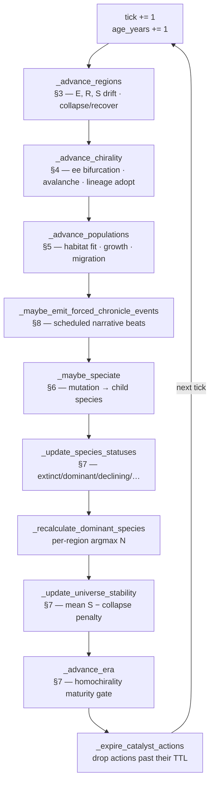

# Evoverse — Simulation Flow & Formulations

> **Status:** reference document for the Phase-1 Alpha engine. Everything below is
> implemented and tested — the formulas are transcribed directly from
> [`SimulationEngine`](../backend/app/simulation/engine.py) and the constants from
> [`rules.py`](../backend/app/simulation/rules.py). When the code and this document
> disagree, **the code is the source of truth**; fix the document.

This is a design/modeling artifact, not an empirical claim about biology. The
science is used as *orientation* — see [`CHIRALITY_AND_MIND.md`](./CHIRALITY_AND_MIND.md)
for the scientific lineage and the chirality/mind thesis. This file is the
end-to-end **flow** of one simulation step and the **closed-form update rules**
that run at each stage.

---

## 1. State model (what a tick operates on)

A universe is a grid of **regions**; each region hosts **populations** (a count of
one **species** in that region). Symbols used throughout:

| Symbol | Meaning | Range | Field |
| --- | --- | --- | --- |
| $E$ | region energy level | $[0,1]$ | `Region.energy_level` |
| $R$ | region resource density | $[0,1]$ | `Region.resource_density` |
| $S$ | region stability | $[0,1]$ | `Region.stability` |
| $\mathit{ee}$ | region enantiomeric excess (signed handedness) | $[-1,1]$ | `Region.chirality_ee` |
| $N$ | population count of a species in a region | $\ge 0$ | `Population.population_count` |
| $g$ | per-tick growth rate | — | `Population.growth_rate` |
| $c_s$ | species handedness | $\{-1,0,+1\}$ | `Species.chirality` |
| $H$ | universe homochirality index — *global* single-handedness, $\lvert\text{mean }\mathit{ee}\rvert$ | $[0,1]$ | `Universe.homochirality_index` |
| $L$ | local order index — $\text{mean }\lvert \mathit{ee}\rvert$, blind to whether regions agree | $[0,1]$ | `Universe.local_order_index` |
| $\beta$ | universe-wide symmetry-breaking field strength | — | `ChiralityRules.field_strength` |
| $\lambda$ | racemization rate — the back-reaction amplification must beat | — | `ChiralityRules.racemization_rate` |
| $\mu$ | pitchfork control parameter, $k-\lambda$; $\le 0$ ⇒ racemic is stable | — | derived |

Two clamps are used everywhere:

$$\operatorname{clamp}(x)=\min(1,\max(0,x)) \qquad \operatorname{clamp}_\pm(x)=\min(1,\max(-1,x))$$

All randomness is **deterministic**: every stochastic draw comes from
`stable_rng(seed, scope, tick, key)` — a hash-seeded RNG so the same seed replays
the same universe. $U(a,b)$ below denotes one such uniform draw.

---

## 2. The tick pipeline (flow)

`SimulationEngine.advance(state, ticks)` runs this ordered pipeline once per tick
([engine.py:51](../backend/app/simulation/engine.py#L51)). **Order matters** —
each stage reads the state the previous stage just wrote.

**Catalyst actions** (§9) are user inputs that sit *outside* this loop: they are
registered asynchronously, bias regions while active, and are cleared in the final
stage once their TTL passes.

---

## 3. Region dynamics — `_advance_regions`

Per region, per tick ([engine.py:104](../backend/app/simulation/engine.py#L104)).
Let $b_E, b_R, b_\mu$ be the active catalyst biases for this region (§9).

**Energy** and **resource** each drift by a random walk pulled back toward an
equilibrium (mean-reverting, i.e. an Ornstein–Uhlenbeck-style step):

$$\Delta E = U(\text{energyDeltaMin},\text{energyDeltaMax}) + b_E + (\bar E - E)\,k_E$$

$$\Delta R = U(\text{resourceDeltaMin},\text{resourceDeltaMax}) + b_R + (\bar R - R)\,k_R$$

**Stability** adds a resource-pressure term — a resource-rich region is easier to
stabilise, capped both ways:

$$p = \operatorname{clip}\big(R - \text{resourceStabilityBaseline},\ \pm\,\text{resourceStabilityBonusCap}\big)$$

$$\Delta S = U(\text{stabilityDeltaMin},\text{stabilityDeltaMax}) + p\cdot\text{resourceStabilityFactor} + (\bar S - S)\,k_S$$

A **collapsed** region bleeds further: $\Delta S \mathrel{-}= \text{collapsedStabilityPenalty}$,
$\Delta E \mathrel{-}= \text{collapsedEnergyPenalty}$. Then apply and clamp:

$$E \leftarrow \operatorname{clamp}(E+\Delta E),\quad R \leftarrow \operatorname{clamp}(R+\Delta R),\quad S \leftarrow \operatorname{clamp}(S+\Delta S)$$

A **mutation-pulse** catalyst trades stability for mutation odds:
if $b_\mu>0$, $S \leftarrow \operatorname{clamp}(S - b_\mu\cdot\text{mutationStabilityPenaltyFactor})$.

**Collapse / recovery** (hysteresis — the recovery band sits strictly above the
collapse band so regions don't flap):

$$\text{collapse} \iff \neg\text{collapsed}\ \wedge\ S<\text{collapseStabilityThreshold}\ \wedge\ R<\text{collapseResourceThreshold}$$

$$\text{recover} \iff \text{collapsed}\ \wedge\ S\ge\text{rec}_S\ \wedge\ R\ge\text{rec}_R\ \wedge\ E\ge\text{rec}_E$$

A resource move of $\ge\text{resourceShiftThreshold}$ in one tick emits a
`REGION_RESOURCE_SHIFT`; a fresh collapse emits `REGION_COLLAPSE`.

**Constants** ([`RegionRules`](../backend/app/simulation/rules.py#L22)):
$\bar E=0.56,\ \bar R=0.52,\ \bar S=0.58$; reversion $k_E=0.018,\ k_R=0.02,\ k_S=0.026$;
collapse $S<0.16 \wedge R<0.18$; recovery $S\ge0.34, R\ge0.32, E\ge0.3$.

---

## 4. Chirality — `_advance_chirality` (T1)

Full spec and scientific mapping live in
[`CHIRALITY_AND_MIND.md` §6.1–6.3](./CHIRALITY_AND_MIND.md). Summary of the update
([engine.py:186](../backend/app/simulation/engine.py#L186)):

**Field.** The universe carries one uniform symmetry-breaking field — the analogue
of Ozturk & Sasselov's magnetized surface. Its sign is drawn once per seed
(`stable_rng(seed, "chirality-field")`), so *which* hand a universe gets is
contingent, but every region feels the same push:

$$B = \pm1 \ \text{(per seed)},\qquad \text{field} = \beta\,B,\quad \beta=\text{fieldStrength}$$

**Bifurcation.** Each *unlocked* region runs a pitchfork step. Amplification (the
cubic) races **racemization** $\lambda$, the thermal back-reaction pulling any
excess toward 50/50. Noise shrinks to $0$ as $|\mathit{ee}|\to1$; the field does
**not** (it is external, not a property of the region's state):

$$\text{noise} = (2\rho-1)\cdot\text{noiseScale}\cdot(1-|\mathit{ee}|),\quad \rho\sim U(0,1)$$

$$\mathit{ee} \leftarrow \operatorname{clamp}_\pm\!\big(\mathit{ee} + k\,\mathit{ee}(1-\mathit{ee}^2) - \lambda\,\mathit{ee} + \beta B + \text{noise}\big)$$

with $k=\text{amplifyK}$, $\lambda=\text{racemizationRate}$. Grouping the linear
terms gives the pitchfork normal form and, with it, an actual **control
parameter**:

$$\mathit{ee} \leftarrow \mathit{ee} + \mu\,\mathit{ee} - k\,\mathit{ee}^3 + \beta B + \text{noise},\qquad \mu = k-\lambda$$

This is what makes the step a bifurcation rather than a permanently
post-bifurcation regime: $\mu>0$ leaves $\mathit{ee}=0$ unstable and a region
commits; $\mu\le0$ makes racemic stable and no number of ticks produces a hand.
Without $\lambda$ the gain had nothing to race, so $\mu=k>0$ always and every
region committed unconditionally.

**Where it settles, and the latch cliff.** Ignoring field and noise, the drift
settles at

$$\mathit{ee}^\ast = \sqrt{1 - \lambda/k}$$

which falls below $\text{eeLockThreshold}$ *long before* $\mu$ reaches zero. Past
that point regions hover short of the latch forever. That matters far more than
$\mu\le0$ does, because everything in T1 downstream of the lock — lineages
adopting a hand (§6.2), heterochiral selection (§5), the Organism Lens — is gated
on `chirality_locked`, while the **Era gate reads the universe mean, not the
locks**. So there is a window where a universe *earns Stabilization while nothing
ever latches and no lineage ever adopts a hand*.

Measured over the 8-seed ensemble (4211–4218) at 600 ticks — the cliff is sharp:

| $\lambda$ | locked / 108 | $H$ | life | mean lock tick |
| --- | --- | --- | --- | --- |
| 0.008 *(default)* | **108** | 1.00 | 8/8 | 64 |
| 0.016 | **108** | 1.00 | 8/8 | 81 |
| 0.018 | **108** | 1.00 | 8/8 | 113 |
| 0.020 – 0.025 | **0** | 0.84 – 0.81 | **8/8** | never ← hollow: alive, handless |
| 0.030 | 0 | 0.77 | 0/8 (starved) | never |
| 0.060 $(=k)$ | 0 | 0.44 | 0/8 | never |

The lock tick in that last column diverges as $\lambda$ approaches the cliff —
64, 81, 113, never — which is **critical slowing down**, the signature of a
continuous transition rather than an abrupt one. The system does not fall off a
ledge at 0.019; it takes longer and longer to commit until, past the cliff, it
never does.

The naive cliff from $\mathit{ee}^\ast$ alone is $\lambda = k(1-\text{lock}^2) =
0.0114$, but that under-predicts by a wide margin: the latch is an **absorbing
barrier** — irreversible — so noise and the field carry regions over it even when
the deterministic fixed point sits below ($\lambda=0.016$ settles at
$\mathit{ee}^\ast=0.86$ and still latches 108/108). Latching survives to $0.018$
and is gone by $0.020$. The default $0.008$ ($\mathit{ee}^\ast=0.93$) sits well
clear, and life is earned at tick $50$ rather than $44$ — racemization is a
headwind, not a wall. `_validate_chirality_latch` warns on both failure modes
from the rules screen.

Reproduce with `make sweep` (`--param racemization_rate`).

Without $\beta B$ the cubic term amplifies whichever way each region's *local*
noise happened to push, and the map freezes into opposing domains: every region
locked, none agreeing. The field is what makes the outcome *homochiral* rather
than merely locked. Measured over the 8-seed ensemble (4211–4218) at 400 ticks,
counting universes that reach a single domain: $\beta=0$ gives **0/8** (≈5
domains each), $\beta=0.001$ gives 2/8, and $\beta\ge0.002$ gives **8/8**. The
default $0.005$ sits a stride past the transition rather than on it.

Reproduce with `make sweep` (`--param field_strength`).

**Lock.** When $|\mathit{ee}|\ge\text{eeLockThreshold}$ the region latches
irreversibly to $\operatorname{sign}(\mathit{ee})$ (`chirality_locked = True`).

**Avalanche.** A locked region with $|\mathit{ee}|\ge\text{avalancheMinSource}$
pushes $\pm\text{avalancheBleed}$ onto each unlocked von-Neumann neighbour, so one
broken hand spreads across the map. Then lineages adopt their origin region's hand
(one-way; §6.2) and the universe metrics recompute (§7).

**Constants** ([`ChiralityRules`](../backend/app/simulation/rules.py#L112)):
$k=0.06$, $\lambda=0.008$ (so $\mu=0.052$), noiseScale $=0.03$, $\beta=0.005$,
lock $=0.9$, bleed $=0.05$, avalancheMinSource $=0.75$.

---

## 5. Population dynamics — `_advance_populations`

Per living population, per tick ([engine.py:304](../backend/app/simulation/engine.py#L304)).

**Habitat fit** — how well a species' traits match its region (dot product of the
region's $[E,R,S]$ against the trait triple, normalised):

$$\phi = \frac{E\cdot\text{efficiency} + R\cdot\text{adaptation} + S\cdot\text{resilience}}{\text{habitatFitDivisor}}$$

**Heterochiral selection** (§6.3). Let $m$ be the hand-mismatch: $m=|\mathit{ee}|$
only when a *committed* lineage ($c_s\neq0$) sits in an opposite-hand region, else
$m=0$. A mismatch taxes fit multiplicatively:

$$\text{if } m>0:\quad \phi \leftarrow \phi\,(1 - \text{heterochiralGrowthPenalty}\cdot m)$$

**Growth.** Fit above a baseline drives growth; crowding and collapse subtract:

$$\text{density} = \min\!\Big(\text{densityPressureCap},\ \tfrac{N}{\text{densityPressureScale}}\Big)$$

$$g = (\phi - \text{growthBaseline})\cdot\text{growthFactor} - \text{density} - \text{collapsePenalty}\cdot[\text{region collapsed}]$$

A **severe** mismatch is lethal — scrambled chirality stores no viable
information:

$$\text{if } m\ge\text{heterochiralLethalLoad}:\quad g \leftarrow \min(g,\ -\text{heterochiralLethalDecline})$$

**Apply** (integer population): $\ N \leftarrow \max\!\big(0,\ \lfloor N(1+g)\rfloor\big)$.

**Migration pressure** — poor fit plus mobility makes a population want to move:

$$\pi = \operatorname{clamp}\big((\text{migrationBaseline} - \phi) + \text{mobility}\cdot\text{migrationTraitFactor}\big)$$

If $N>\text{migrationMinPopulation}$ and $\pi>\text{migrationPressureThreshold}$,
a fraction $\text{migrationFraction}$ moves to the best adjacent non-collapsed
region (argmax of $E+R+S$) — see `_migrate_population`.

A drop below $\text{declinePopulationRatio}$ of the previous count (when previously
$>\text{declineMinPreviousPopulation}$) emits `SPECIES_DECLINED`.

**Species-level load.** Mismatch is aggregated population-weighted across all a
lineage's regions into `Species.heterochiral_load`:

$$\text{load}_s = \frac{\sum_r m_{s,r}\,N_{s,r}}{\sum_r N_{s,r}}$$

**Constants** ([`PopulationRules`](../backend/app/simulation/rules.py#L54)):
divisor $=3.0$, growthBaseline $=0.31$, growthFactor $=0.14$, densityCap $=0.16$,
densityScale $=180000$, collapsePenalty $=0.09$; heterochiral penalty $=0.35$,
lethal load $=0.85$, lethal decline $=0.5$.

---

## 6. Speciation — `_maybe_speciate`

Runs when $\text{tick} \bmod \text{intervalTicks}=0$ **or** a mutation-pulse
catalyst is active ([engine.py:438](../backend/app/simulation/engine.py#L438)).
Candidates are populations with $N>\text{candidateMinPopulation}$ of a non-extinct
species; a mutation pulse restricts the draw to its region.

**Child traits.** Each of the five traits gets an independent uniform delta:

$$\text{trait}_{\text{child}} = \operatorname{clamp}\big(\text{trait}_{\text{parent}} + U(\delta_{\min},\delta_{\max})\big)$$

**Chiral inheritance** (§6.2). The child inherits the parent's hand
$c_{\text{child}}=c_{\text{parent}}$; a rare flip (prob $\text{inheritFlipChance}=0.01$)
sets $c_{\text{child}}=-c_{\text{parent}}$ — almost always lethal, since the flipped
hand is heterochiral in its (parent-handed) origin region (§5).

**Founder split.** The child seeds from the parent population:

$$N_{\text{child}} = \max\!\big(\text{childMinPopulation},\ \lfloor N_{\text{parent}}\cdot\text{childPopulationFraction}\rfloor\big),\qquad N_{\text{parent}} \mathrel{-}= N_{\text{child}}$$

Emits `MUTATION_DETECTED` + `SPECIES_EMERGED`. **Constants**
([`SpeciationRules`](../backend/app/simulation/rules.py#L73)): interval $=149$ ticks,
candidate $>1800$, childFraction $=0.16$, childMin $=80$.

---

## 7. Aggregation, status, stability, era

**Species status** ([engine.py:584](../backend/app/simulation/engine.py#L584)) — let
$T_s$ be a species' total population across regions and $T_{\max}$ the largest:

$$\text{status}(s)=\begin{cases}
\textsf{EXTINCT} & T_s \le \text{extinctPopulation}\ (12)\\
\textsf{DOMINANT} & T_s \ge \text{dominantShare}\cdot T_{\max}\ \wedge\ T_s>\text{dominantMinPopulation}\\
\textsf{DECLINING} & T_s < \text{decliningPopulation}\ (650)\\
\textsf{EMERGING} & \text{gen}>1\ \wedge\ (\text{age}-\text{emergedAt})<\text{emergingAgeWindow}\\
\textsf{STABLE} & \text{otherwise}
\end{cases}$$

(evaluated top-down; first match wins — dominantShare $=0.82$).

**Dominant species per region:** $\operatorname{argmax}_s N_{s,r}$ over populations
with $N>0$.

**Universe stability** ([engine.py:619](../backend/app/simulation/engine.py#L619)) —
mean region stability, penalised by the share of collapsed regions:

$$\text{stabilityIndex} = \operatorname{clamp}\!\left(\frac{1}{|\mathcal R|}\sum_{r} S_r - \frac{|\{r:\text{collapsed}\}|}{|\mathcal R|}\cdot\text{collapseRatioStabilityPenalty}\right)$$

**Homochirality** ([seeder.py:62](../backend/app/simulation/seeder.py#L62)) — over
non-collapsed regions $\mathcal R'$:

$$\mathit{ee}_{\text{universe}}=\frac{1}{|\mathcal R'|}\sum_{r\in\mathcal R'}\mathit{ee}_r \qquad
H = \big|\mathit{ee}_{\text{universe}}\big| \qquad
L = \frac{1}{|\mathcal R'|}\sum_{r\in\mathcal R'}|\mathit{ee}_r|$$

$H$ (`homochirality_index`) is the **global** single-handedness and is what the
Era gate reads: $1$ only when every region agrees on one hand. $L$
(`local_order_index`) is how far regions are from racemic *locally*, blind to
whether they agree. `domain_count` is the number of connected same-hand regions
(von Neumann adjacency, collapsed regions excluded and acting as holes);
$\text{domain\_count}=1$ is the real signature of homochirality.

> **Why $H$ is not $L$.** $L$ is the mean of *absolute* values, so a map split
> into equal and opposite domains scores $L=1$ — "fully homochiral" — while being
> globally racemic ($H=0$). Before the field term (§4) this was the *typical*
> outcome, not an edge case: on the base seed, 54 regions locked right and 54
> left, $L=1.0$, $H=0.0$, and the old $L$-based gate handed that universe the
> Stabilization Era. Life's homochirality is a global property — all of it runs
> on one hand — so the gate must measure the global one. The gap $L-H$ is exactly
> the domain problem, which is why both are kept.

**Era gate** ([engine.py:633](../backend/app/simulation/engine.py#L633)) — eras are
**earned and monotonic** (never seeded, never lost):

$$\begin{aligned}
\to \textsf{STABILIZATION} &\quad\text{when } H \ge \text{lifeGateIndex}\ (0.8) &&\text{(chemistry → life)}\\
\to \textsf{INTELLIGENCE} &\quad\text{when } H \ge \text{mindGateIndex}\ (0.92)\ \wedge\ \exists\,s:\text{mind\_locked} &&\text{(life → mind, T2)}
\end{aligned}$$

Because no lineage locks a mind until the cognitive tier (T2) ships, Intelligence
is currently unreachable by design — see [§6.4](./CHIRALITY_AND_MIND.md).

> **Monotonicity now comes from the rank guard, not from the metric.** When $H$
> was $L$ (mean $|ee|$) it could only ever rise, because locking pins $|ee|$ at
> $1$ — the index was monotone by construction. Global $H$ is **not**: a region
> locking against the current majority *lowers* it. Eras are still never lost,
> but only because `_advance_era` compares `_ERA_RANK` and refuses to move
> backward. The gate is now genuinely failable — a universe that never picks one
> hand never earns Stabilization (§4, $\beta=0$) — which is the point: a gate
> that always passes is not a gate. On the base seed with the default field,
> Stabilization is earned around tick 44.

---

## 8. Forced chronicle events — `_maybe_emit_forced_chronicle_events`

Deterministic narrative beats on fixed cadences so an observed universe never goes
silent for long ([engine.py:383](../backend/app/simulation/engine.py#L383)). These
run on `tick mod interval` schedules independent of the organic rules above:
resource shift every $13$ ticks (rise on multiples of $26$, else fall), a nudged
decline every $17$, a forced collapse every $151$. Constants:
[`ChronicleRules`](../backend/app/simulation/rules.py#L93).

---

## 9. Catalyst actions (user influence)

A catalyst is a **bounded, regional** user input — it never creates species and
never applies globally ([engine.py:67](../backend/app/simulation/engine.py#L67)).
On registration it gets `expires_at_tick = tick + effectTicks` and, while active,
adds `strength` to its region's bias:

| Action | Effect while active | Bias |
| --- | --- | --- |
| `ENERGY_PULSE` | $+\text{strength}$ to $\Delta E$ | $b_E$ |
| `RESOURCE_BURST` | $+\text{strength}$ to $\Delta R$ | $b_R$ |
| `MUTATION_PULSE` | stability tax + forces a speciation draw in-region | $b_\mu$ |

**Constants** ([`CatalystRules`](../backend/app/simulation/rules.py#L8)):
strength $=0.18$, effectTicks $=8$; daily limits energy $3$ / mutation $1$ /
resource $1$. The full API contract is in [`CATALYST_API.md`](./CATALYST_API.md).

---

## 10. Rule tuning & determinism

- **All constants are runtime-tunable** via the admin rules API and validated in
  [`rule_config.py`](../backend/app/simulation/rule_config.py) — range checks,
  `min ≤ max` pairing, and cross-field invariants (e.g. recovery band strictly
  above collapse band). See [`ADMIN_SIMULATION_CONTROLS.md`](./ADMIN_SIMULATION_CONTROLS.md).
- **Determinism:** identical `(seed, rules, tick)` ⇒ identical universe. Every
  random draw is hash-seeded through
  [`stable_rng`](../backend/app/simulation/randomness.py); there is no wall-clock or
  global RNG in the step. This is what makes Replay/Forecast reproducible.

---

## References

- **Chirality/mind thesis, scientific lineage, and the T1/T2 design:**
  [`CHIRALITY_AND_MIND.md`](./CHIRALITY_AND_MIND.md).
- **Correlation & pattern-detection formulas** (a separate analytic layer over
  these events): [`CORRELATION_AND_PATTERNS.md`](./CORRELATION_AND_PATTERNS.md).
- **Event payloads** each stage emits: [`EVENT_PAYLOAD_SCHEMAS.md`](./EVENT_PAYLOAD_SCHEMAS.md).
- **Domain vocabulary:** [`DOMAIN_GLOSSARY.md`](./DOMAIN_GLOSSARY.md).
- **Source of truth:** [`engine.py`](../backend/app/simulation/engine.py),
  [`rules.py`](../backend/app/simulation/rules.py),
  [`seeder.py`](../backend/app/simulation/seeder.py).
</content>
</invoke>
